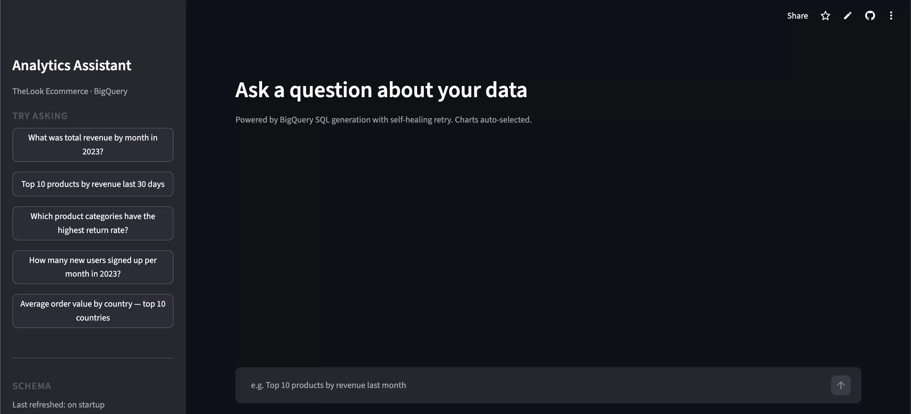
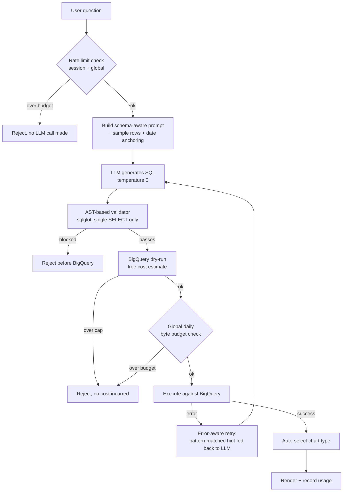

# QueryLens

[](https://github.com/harshilarora2005/queryLens/actions/workflows/ci.yml)

**Ask a business question in plain English, get back validated SQL, a cost estimate, and a chart — with self-healing retries when the SQL fails.**

🔗 [Live demo](https://querylens-assistant.streamlit.app/)




---

## Why this exists

Most people who need an answer from a database can't write SQL, and most analysts don't want to be a human API for "quick questions." QueryLens is a schema-aware NL→SQL assistant on top of BigQuery: it turns a question like *"which product categories have the highest return rate?"* into a safety-checked, cost-estimated query, runs it, and picks a chart — with a real safety and budget layer underneath, not just an LLM call with a prayer.

Built on [TheLook Ecommerce](https://console.cloud.google.com/marketplace/product/bigquery-public-data/thelook-ecommerce) (BigQuery public dataset, queried directly — no local copy needed): ~180K orders, ~5M order items, 100K customers.

---

## How it works



Conversation memory keeps the last few turns in context so follow-up questions work naturally.

---

## A few things worth knowing

**The SQL validator parses, not pattern-matches.** Rather than a regex keyword blocklist, `sql_validator.py` uses [`sqlglot`](https://github.com/tobymao/sqlglot) to parse the generated SQL into a real AST and checks it's a single SELECT statement with no DDL/DML anywhere in the tree — including nested inside a CTE. This closes the gap a blocklist has: multi-statement injection (`SELECT 1; DROP TABLE x`) and destructive statements hidden in a subquery are structurally impossible to sneak past, not just usually caught.

**Cost is enforced, not just displayed.** Every query gets a free BigQuery dry-run before execution. If the estimate exceeds a configurable per-query cap, or would push a rolling 24-hour global budget over its limit, the query is rejected before it runs — enforced via BigQuery's own `maximum_bytes_billed` job config, not just a UI warning that a determined caller could bypass.

**Two independent rate-limit layers.** Per-session (caps one browser tab's queries per hour) and global (caps total queries + bytes billed across every user on the server per day, shared via `st.cache_resource`). The global layer is what actually bounds worst-case spend once this is deployed publicly.

**The retry loop is error-aware.** When BigQuery rejects a query, the error message is pattern-matched against known failure modes (wrong argument count, bad column name, syntax error, etc.) and a targeted hint is added to the fix prompt. Generic "fix this" prompts don't work reliably — the hint is what makes the self-healing actually self-heal.

**Date anchoring.** The dataset isn't current (it runs to late 2023). On startup, the app queries the real `MIN`/`MAX` dates from the orders table and injects them into the system prompt, so "last 30 days" generates SQL anchored to the data's most recent date — not today.

**Billing project ≠ data project.** The app bills queries through your own GCP project but reads tables directly from Google's `bigquery-public-data` project by default — no need to pay to store your own copy of a public dataset. `BQ_SOURCE_PROJECT` and `GCP_PROJECT_ID` are separate settings for exactly this reason.

**Schema refresh is a true singleton.** The background schema-refresh scheduler starts exactly once per server process (via `st.cache_resource`), not once per browser session — a guard based on `st.session_state` alone would spin up a duplicate `BackgroundScheduler` (and duplicate BigQuery re-extraction cost) per user.

---

## Measuring accuracy, not just vibes

`eval/` contains a 20-question hand-labeled golden set grounded in the actual schema, graded structurally (right tables, right joins, right aggregation, right grouping) rather than against exact output values — exact-value grading would break every time the underlying public dataset changes.

```bash
python -m eval.run_eval              # dry-run mode: real LLM + free BigQuery dry-run, no execution cost
python -m eval.run_eval --live       # full execution through the self-healing retry loop
python -m eval.run_eval --limit 5    # quick smoke check
```

Results are saved as timestamped JSON in `eval/results/` for tracking accuracy over time. The grading logic itself (`eval/grading.py`) is unit-tested offline in CI with no LLM or BigQuery calls required.

---

## Stack

- **BigQuery** — query engine and dataset (queried directly from `bigquery-public-data`, no copy)
- **OpenAI / Gemini** — LLM provider (swap via `.env`, no code changes)
- **sqlglot** — AST-based SQL safety validation
- **Streamlit** — UI
- **Plotly** — charts
- **APScheduler** — background schema refresh
- **Docker** — containerized deployment
- **GitHub Actions** — CI (lint, type-check, tests, Docker build)

---

## Setup

```bash
python -m venv venv && source venv/bin/activate
pip install -r requirements-dev.txt   # or requirements.txt for runtime-only
cp config/.env.example config/.env
```

Fill in `config/.env`:

```
GCP_PROJECT_ID=your-billing-project-id
BQ_SOURCE_PROJECT=bigquery-public-data   # default — no need to copy the dataset
BQ_DATASET=thelook_ecommerce
LLM_PROVIDER=openai                       # openai | gemini
OPENAI_API_KEY=sk-...
GOOGLE_APPLICATION_CREDENTIALS=(paste the json as it is)
```

Pull the live schema from BigQuery (writes `config/schema_metadata.json`):

```bash
python ingestion/schema_extractor.py
```

Run:

```bash
streamlit run main.py
```

### Run with Docker instead

```bash
docker build -t querylens .
docker run -p 8501:8501 \
  -v $(pwd)/config/.env:/app/config/.env \
  -v $(pwd)/credentials:/app/credentials \
  querylens
```


---

## Project layout

```
├── main.py                        # Streamlit entry point
├── Dockerfile
├── .dockerignore
├── requirements.txt                # runtime deps, pinned
├── requirements-dev.txt            # + pytest, ruff, mypy
├── pyproject.toml                  # ruff + mypy config
├── .github/workflows/ci.yml        # lint, type-check, tests, Docker build
├── config/
│   ├── .env.example
│   └── schema_metadata.json        # injected into every LLM prompt
├── core/
│   ├── sql_generator.py            # prompt builder + retry loop
│   ├── sql_validator.py            # sqlglot AST-based safety check
│   ├── bq_executor.py              # dry-run cost estimate + enforced execution cap
│   ├── rate_limiter.py             # per-session + global rate/budget limiting
│   └── llm_client.py               # OpenAI / Gemini wrapper
├── components/
│   ├── chat_ui.py                  # message rendering
│   ├── viz.py                      # auto chart selection
│   ├── cost_badge.py               # query cost display
│   └── session.py                  # conversation state
├── ingestion/
│   ├── schema_extractor.py         # pulls schema from live BQ tables
│   ├── schema_refresh.py           # singleton background refresh
│   └── load_to_bigquery.py         # optional: load your own data instead
├── eval/
│   ├── golden_set.json             # 20 hand-labeled NL->SQL questions
│   ├── grading.py                  # structural grading logic
│   ├── run_eval.py                 # eval runner (dry-run or --live)
│   └── results/                    # timestamped accuracy runs
└── tests/
```

---

## Running tests

```bash
pytest tests/ -v
```

All tests mock `bigquery.Client` and the LLM client, so the full suite runs without any GCP connection or API keys. The eval *harness* itself is tested this way too (`tests/test_eval_grading.py`); running the eval *against* a real LLM/BigQuery is a separate, deliberately manual step (`python -m eval.run_eval`) since it costs real tokens/BigQuery bytes.

---

## Switching LLM providers

Change one line in `config/.env`:

```
LLM_PROVIDER=gemini   # or openai
```